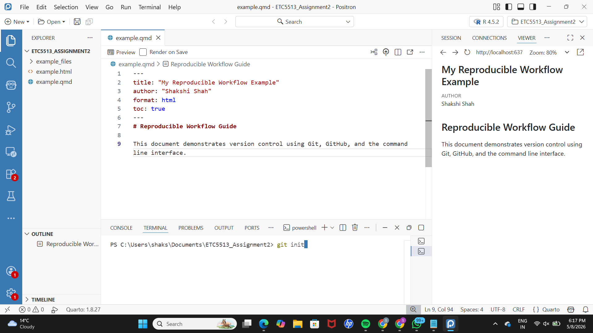
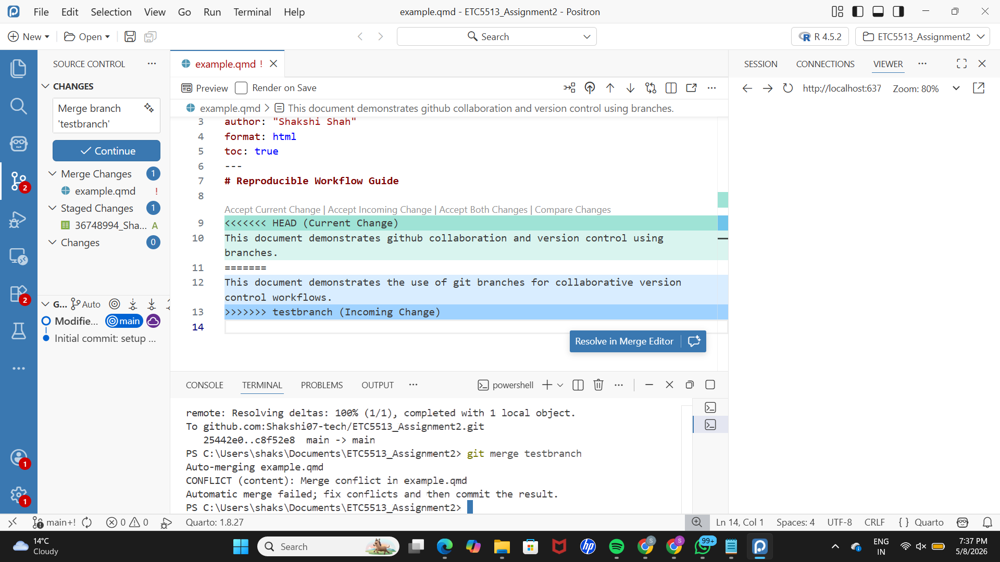
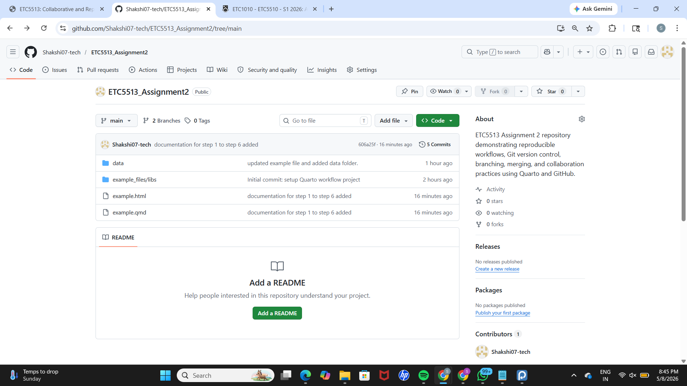
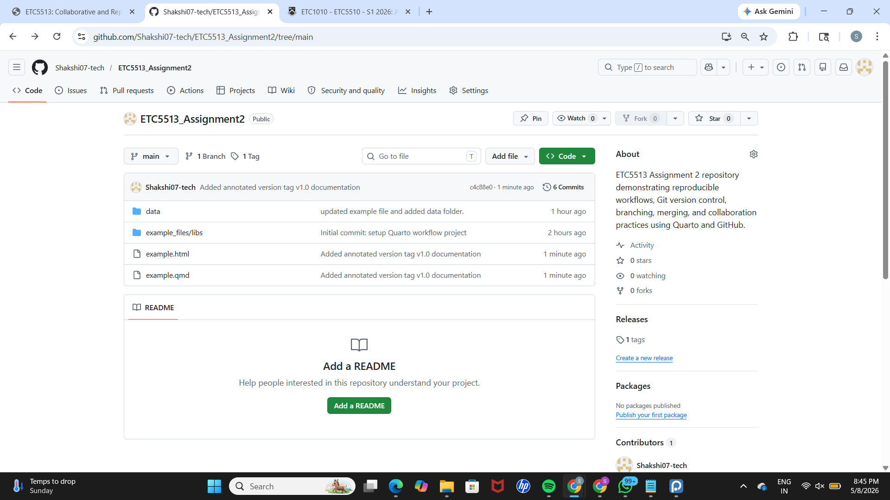

# Reproducible Workflow Guide

This document demonstrates github collaboration and version control using branches.

## Step 1: Creating the Quarto Document

A new project was created in Positron for this assignment workflow. Within the project directory, a Quarto file named `example.qmd` was created.

The document was then rendered into HTML format using the following terminal command:

`quarto render example.qmd --to html`

This step confirmed that the Quarto setup was correctly configured and that the document could be successfully converted into an HTML output.

## Step 2: Initialising Git and Connecting to GitHub

The project folder was initialised as a Git repository using:

`git init`

This enabled version control, allowing Git to track and manage changes made within the project.

All project files were staged and committed to establish the initial version of the repository.

A GitHub repository was then linked to the local repository using the following commands:

`git remote add origin <repository-url>`
`git branch -M main`
`git push -u origin main`

These commands connected the local project to GitHub and uploaded the initial commit to the remote repository.

## Step 3: Creating and Updating a Branch

A new branch called `testbranch` was created and switched to using:

`git checkout -b testbranch`

This allowed development to continue independently from the main branch without affecting the stable version of the project.

The introduction section in `example.qmd` was modified within this branch to demonstrate version tracking.

The changes were committed and pushed to GitHub using:

`git push -u origin testbranch`

This ensured the branch was also available in the remote repository for tracking and collaboration purposes.

## Step 4: Amending the Previous Commit

A new folder named `data` was created, and the dataset from Assignment 1 was added into it.

Instead of creating a new commit, the previous commit was updated using:

`git commit --amend -m "Updated project structure and included Assignment 1 dataset in data folder"`

This approach maintained a cleaner commit history by combining related changes into a single commit.

The amended commit was pushed to GitHub using a force push:

`git push --force`

This was necessary because amending a commit changes its history and therefore requires overwriting the remote version.

## Step 5: Creating a Conflict on Main

The `main` branch was checked out again, and the same section of `example.qmd` was modified differently from the version in `testbranch`.

The changes were committed and pushed to GitHub.

By editing the same section in two different ways across branches, a deliberate merge conflict scenario was created for demonstration purposes.

## Step 6: Merging and Resolving the Conflict

The `testbranch` was merged into the `main` branch using:

`git merge testbranch`

Git detected a conflict because the same section of text had been modified differently in both branches.
The conflict was resolved manually by editing the file, removing the conflict markers, and retaining the correct final version of the content.

Once resolved, the merge was completed using:

`git commit -m "Resolved merge conflict between main and testbranch by integrating both changes"`

Finally, the updated version of the project was pushed to GitHub, ensuring that the resolved merge was reflected in the remote repository.

## Step 7: Tagging the Project Version

An annotated tag `v1.0` was created to mark a stable version of the project after completing branching, merging, and data integration.

Tags help identify important milestones in a Git repository.

## Step 8: Branch Cleanup

The `testbranch` was deleted locally and remotely after successful merging into the main branch.

This keeps the repository clean and avoids unnecessary branches.

## Step 9: Commit History

A condensed commit history was displayed using `git log --oneline`.

This provides a simplified view of all changes made throughout the project.

